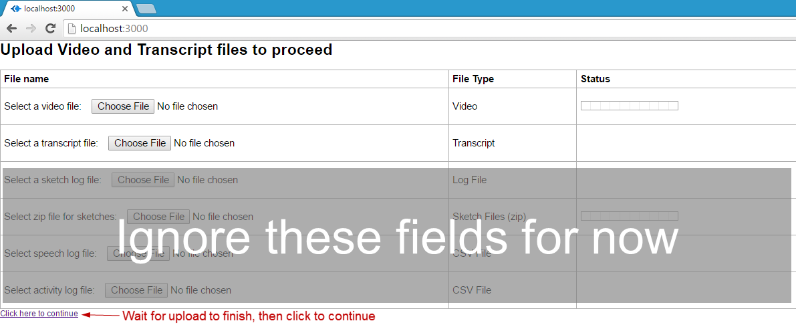
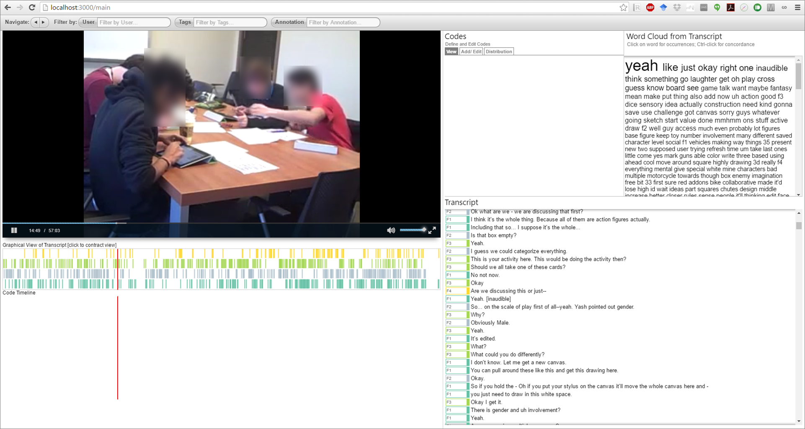
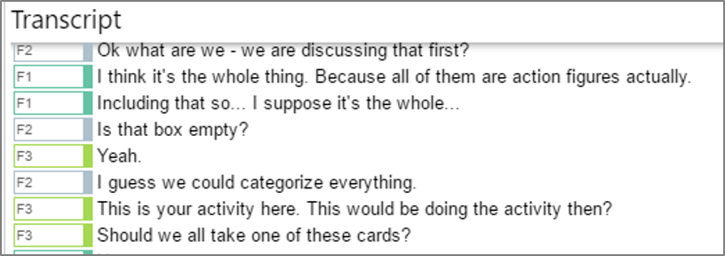
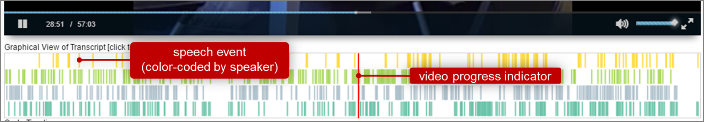
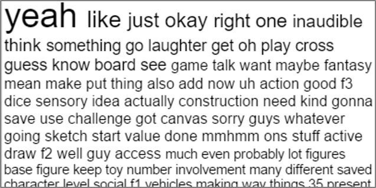
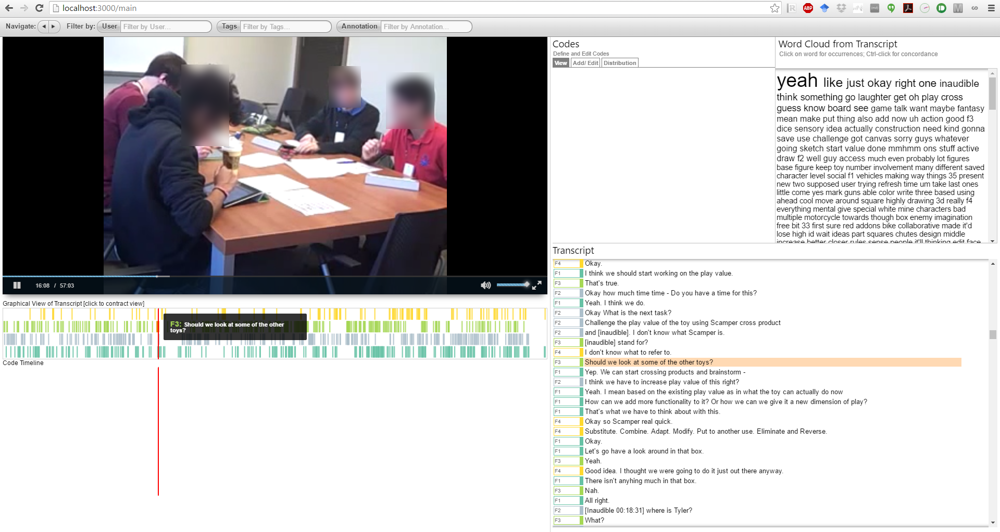
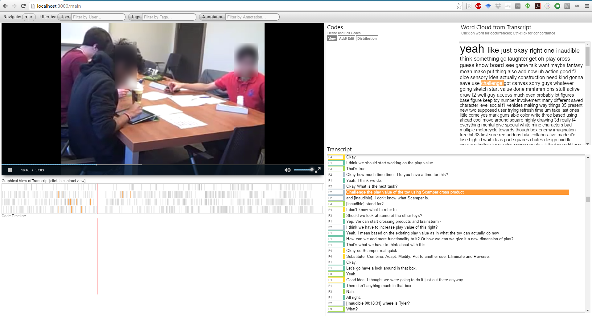
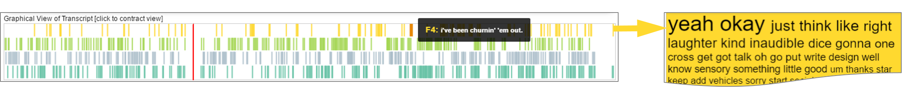

# VizScribe | Wiki
VizScribe is currently tested to run on Google Chrome, on Windows and OS
X systems.
Follow the instructions below for installation and use.

## Installation
1. Make sure [Node.js](https://nodejs.org/) is installed on your system
2. Download the source code
3. On the Node.js Command Prompt (for Windows) or Terminal (for OS X), navigate to the main folder (the one that contains the file `app.js`) and type in:
```javascript
   npm install
```

This installs all required modules.

## Running VizScribe
Before running VizScribe, you need to have the following data:
1. A video file (mp4 format)
2. A corresponding transcript file with timestamps.
   The formatting of the transcript should be:

    ```Text
       start time,end time,speaker,dialog
       00:00:01.5,00:00:03.0,Travis Bickle,You talkin' to me?
    ```

   Note that the timestamps follow the format `hh:mm:ss.s` 

There are other time-sequenced data that you can upload and link, but
the video and transcript are essential.

On the Node.js command prompt or Terminal, navigate to the main folder (the one containing app.js).
Type in the command:
```javascript
node app.js
```

Launch the Chrome browser, type ` localhost:3000 ` into the address bar.
The page that loads will look somewhat like this:


Upload the video and transcript as requested, and click on the link
below to continue.


The page should direct you to a view of your video and transcript that
looks somewhat like this:


## Exploring the visualizations
Apart from the video, you will see 3 main views at this point.

The transcript view:



A representation of the transcript as a series of "speech events" on a timeline, color-coded by speaker (see the corresponding colors on the transcript view above).




And finally, a word cloud view that is generated from the whole transcript. 
Individual words are scaled according to the number of times they occur in the transcript.



### Links between views
All the above visualizations are interlinked; i.e. you can click on one
of the speech event timeline items, and the video will skip to it, while
the transcript scrolls to the corresponding utterance.

Alternately, you can also `[ctrl-click]` a line on the transcript for the video to skip to the corresponding time.




Hovering on, or selecting a word on the word cloud highlights all its occurrences on the transcript and the speech timeline views:



### Filtering the Word Cloud
The word cloud's default data is the entirety of the transcript. However, you can `[ctrl-click]` a speaker's speech timeline, and the word cloud will now only show the words spoken by that person.




You can also select a block of text in the transcript, and the word cloud will update according to the selection.


You can also pull up a "keyword in context" view, or concordance view: `[ctrl-click]` a word in the word cloud to pull up a view of the words immediately preceding and succeeding the selected word.
This can give some idea of the _context_ in which the word has been used.


Finally, right-click on a word to remove it from the word cloud. At the moment, this action cannot be undone, so try it at your own risk!

## Coding
As a protocol analyst, you may want to identify certain kinds of behavior or speech and categorize it as such.
To first specify such a tag, 


